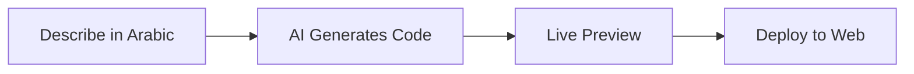

# 🧡 VibeSaudi

> **The first Arabic vibe coding platform** – Build full-stack web apps in Arabic using natural language. Free for Arabs.

## 🚀 Live Demo

**[vibesaudi.dev](https://vibesaudi.dev)**

*Start building apps in Arabic today*

---

## ✨ What is VibeSaudi?

VibeSaudi is the **first AI coding platform designed for Arabic speakers**. Built by **Orang AI**, it lets you describe what you want to build in Arabic (or English), and AI will generate, preview, and deploy your application instantly.

🇸🇦 **Free for all Arabs** – No credit card required

**🌐 [Try it now at vibesaudi.dev](https://vibesaudi.dev)**

---

## 🎯 Why VibeSaudi?

### 🌍 **Built for Arabs**
- Full Arabic language support
- Understands Saudi dialect and context
- Optimized for MENA market needs
- Sharia-compliant templates

### ⚡ **Lightning Fast**
- Describe your app in seconds
- Live preview as it builds
- Deploy with one click
- No coding required

### 🎨 **Modern & Professional**
- React + TypeScript + Tailwind
- Mobile-responsive by default
- Production-ready code
- Clean, maintainable architecture

---

## 💡 Example Prompts

**Arabic Prompts:**
> "اصنع لي تطبيق لتتبع المصاريف مع رسوم بيانية"

> "صمم لي موقع لمطعمي مع قائمة الطعام"

> "ابني لي حاسبة ضريبة القيمة المضافة للسعودية"

**English Prompts:**
> "Create a Hijri calendar converter with prayer times"

> "Build an Arabic invoice generator for Saudi businesses"

> "Make a real estate listing platform for Riyadh"

---

## 🚀 How It Works

1. **📝 Describe** your app in Arabic or English
2. **🤖 AI builds** your app phase by phase
3. **👀 Preview** it live in real-time
4. **💬 Refine** through conversation
5. **🚀 Deploy** with one click

---

## 🎯 Perfect For

- **🏢 Saudi Businesses** – Build internal tools without hiring developers
- **🎓 Students & Learners** – Learn by building real projects
- **💼 Entrepreneurs** – Launch MVPs in hours, not months
- **🎨 Designers** – Turn mockups into working apps
- **📱 Marketers** – Create landing pages and campaigns

---

## ⚡ Key Features

- 🇸🇦 **Arabic-First** – Native Arabic support, not just translation
- 🤖 **AI-Powered** – Smart code generation with error correction
- 📱 **Responsive** – Mobile, tablet, and desktop ready
- 🚀 **Instant Deploy** – Live on the web in seconds
- 💬 **Chat Interface** – Iterate and improve through conversation
- 📊 **Saudi Templates** – Pre-built components for local market
- 🔒 **Secure** – Enterprise-grade security and privacy

---

## 🏗️ What You Can Build

| Category | Examples |
|----------|----------|
| **Business** | Invoice generators, CRM systems, dashboards |
| **E-commerce** | Product catalogs, booking systems, marketplaces |
| **Utilities** | Calculators, converters, QR generators |
| **Content** | Blogs, portfolios, landing pages |
| **Arabic Tools** | Hijri calendars, prayer time apps, Arabic forms |

---

## 🎓 Getting Started

### 1. Visit VibeSaudi
Go to **[vibesaudi.dev](https://vibesaudi.dev)** and create your free account

### 2. Describe Your App
Tell the AI what you want to build in Arabic or English

### 3. Watch It Build
See your app come to life in real-time with live previews

### 4. Deploy & Share
One click to make your app live on the web

**That's it!** No installation, no setup, no coding required.

---

## 🔒 Privacy & Security

- 🔐 **Encrypted Data** – All your information is encrypted
- 🏰 **Sandboxed Apps** – Generated apps run in isolated containers
- 🛡️ **Secure by Default** – Industry-standard security practices
- 📝 **Your Code** – You own everything you create

---

## 💎 Pricing

**Free for Arabs** 🇸🇦
- Unlimited app generation
- Live previews
- One-click deployment
- GitHub export
- Full feature access

*No credit card required*

---

## 🇸🇦 Built for Saudi Arabia

VibeSaudi is optimized for the Saudi market with:
- ✅ Arabic language understanding (including dialects)
- ✅ Hijri calendar support
- ✅ Prayer time integration
- ✅ VAT calculation (15%)
- ✅ SAR currency formatting
- ✅ RTL (right-to-left) layouts
- ✅ Saudi business templates

---

## 📚 Resources

- 📖 [Documentation](https://vibesaudi.dev/docs) *(coming soon)*
- 💬 [Discord Community](https://discord.gg/vibesaudi) *(coming soon)*
- 🎥 [Video Tutorials](https://youtube.com/@orangai) *(coming soon)*
- 📧 [Support](mailto:support@orangai.sa)

---

## 🏢 About Orang AI

VibeSaudi is built by **Orang AI**, a Saudi AI company on a mission to make technology accessible to every Arabic speaker. We believe the future of coding is in natural language, not syntax.

**🌐 [Learn more about Orang AI →](https://orangai.sa)**

---

## 📄 License & Usage

VibeSaudi is **proprietary software** made available **free for Arabs**. 

- ✅ Free to use for personal and commercial projects
- ✅ Deploy unlimited apps
- ✅ Export your code
- ❌ Not open source
- ❌ Redistribution not permitted

For licensing inquiries: **legal@orangai.sa**

---

**Built with 🧡 by Orang AI in Saudi Arabia**

**[Start Building →](https://vibesaudi.dev)**

